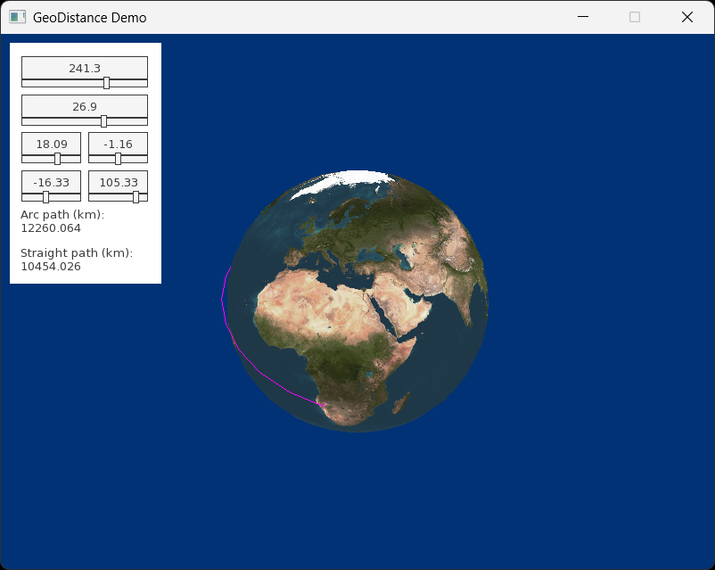

# GeoDistance

## About

It uses custom [software renderer](https://github.com/igor-240340/SoftwareRenderer).

## Documentation
/docs directory contains math models in GeoGebra/Mathcad as well as some study material.

## Build
Visual Studio 2022/C++20

